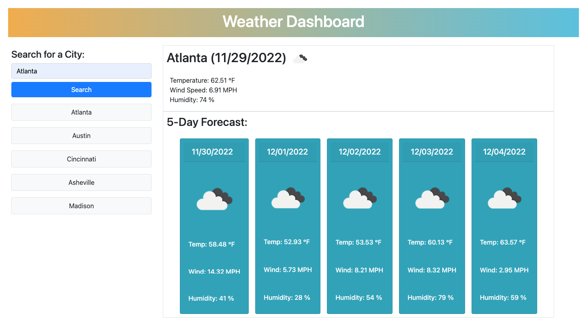

# 06-Weather-Dashboard

## Description

The 06-Challenge Weather Dashboard involved calling two APIs from Open Weather to display current weather conditions and a 5-day forecast for a city searched by the user.

The work weather dashboard includes a column on the left side of the screen containing a search bar where the user can input a city name. After the user inputs a city name, current weather and a 5-day forecast is displayed to the right and the city name is saved to local storage. A clickable button with that city name is placed below the search bar so that the user can re-search that city by clicking its designated button.

## Mock Up

The following image shows the Weather Dashboard appearance and functionality:

## Link

https://swaguespack.github.io/Shellbys-Weather-Dashboard/